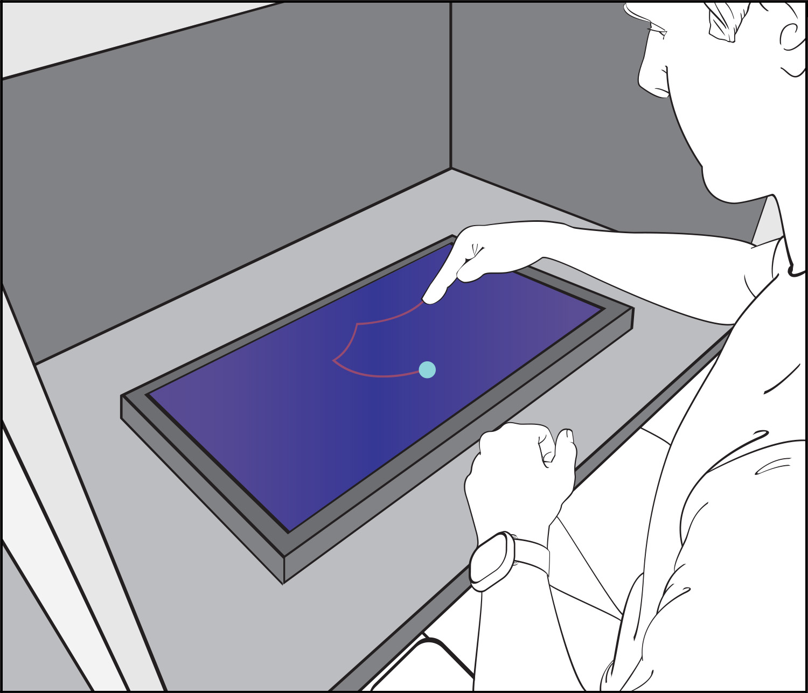
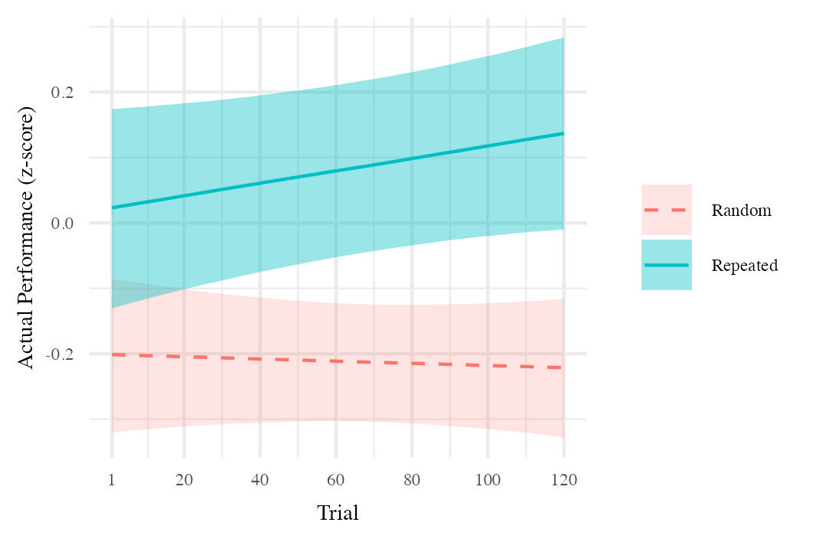

# Detecting Errors in Motor Imagery (DEMI)

Project overview. 
We designed the DEMI experiment to ask whether imagined movements process accuracy like executed movements. Paper 1 (behaviour; scripts 00–03) shows that self-reported accuracy in imagery tracks the same movement characteristics that drive overt error (speed, complexity, familiarity), with vividness of imagery playing a comparatively small role, consistent with imagery as a simulation of a movement attempt, rather than simply thinking about the movement (elaborating on what it looks like, goals, etc.). Paper 2 (EEG; scripts 04+) extends this by modelling scalp-level activity with hierarchical GAMs: frontal theta error-monitoring and the post-movement beta rebound are attenuated in imagery relative to overt movement, while posterior alpha suppression appears shared.

This repository hosts the analysis code for the DEMI project. It has **two parts**:

- **Paper 1 — Behaviour (scripts 00–03)**: results published (see reference below) and reproduced here unchanged.
- **Paper 2 — EEG + hierarchical GAMs (scripts 04+)**: coming next; scaffolded but not included yet.

## What’s here now (Paper 1)
- `R/00–03` — behaviour import, preprocessing, imagery cleanup (Stan), and analysis.
- `_Scripts/` — legacy helpers/settings and small RDS artifacts (created locally).
- `_Data/` — local only; not tracked.
- `legacy/dissertation/` — archival dissertation-era code (read-only import).1

## Results snapshot (Paper 1)
Below are two representative figures from the published behaviour analyses.

  

  

*(Exact figure generation lives in scripts 00–03; raw/large data are not distributed.)*

## Paper 2

Note: EEG preprocessing (prerequisite): Before running R scripts 04+, run the TraceLab EEG pipeline (https://github.com/LBRF/DEMI_EEG_Pipeline) first to produce preprocessed EDF+ files (and prep_info.csv), then place them under /_Data/eeg/edfs/ and /_Data/eeg/prep_info.csv.

## Data availability
Individual-level data are not posted here. If you require access for bona fide reproducibility, please contact the author; access may depend on ethics/consent constraints.

## References
- Ingram, T. G. J., Hurst, A. J., Solomon, J. P., Stratas, A., & Boe, S. G. (2022).  
  *Imagined Movement Accuracy Is Strongly Associated With Drivers of Overt Movement Error and Weakly Associated With Imagery Vividness.*  
  **JEP: Human Perception & Performance, 48(12), 1362–1372.** https://doi.org/10.1037/xhp0001064
- Task code: **TraceLab** — https://github.com/LBRF/TraceLab

## Notes
1. My PhD dissertation is complete and available online, but that's not necessarily what ended up in peer-reviewed publications (which is what you'll find here on this repo). The dissertation-era pipeline is preserved at `legacy/dissertation/` and remains the canonical artifact referenced by the thesis text.
2. When Paper 2 is added, the EEG pipeline (04+) will produce compact tables/figures and I’ll pin minimal artifacts for reproducibility.
