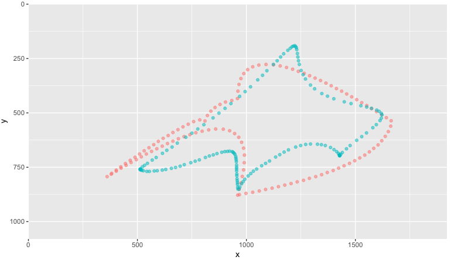

# TraceLabAnalysis

A set of R scripts for importing, preprocessing, and visualizing data collected with [TraceLab](https://github.com/LBRF/TraceLab).





These scripts are designed to be a template that different TraceLab analyses can be based on, leaving final data cleaning and modelling scripts for specific projects to be added by the user.


## Requirements

All dependencies for these scripts can be installed by running the following line:

```r
install.packages(c("tidyverse", "TSEntropies", "vegan", "dtw"))
```

The scripts have been developed and tested on R 3.6. They may work with older versions of R but are not guaranteed to function correctly.


## Usage

1. Place all task data (`*.txt`) files exported from TraceLab in `_Data/task/`.
2. Place all figure data (`*.zip`) files from TraceLab in `_Data/figure/`.
3. Open a new R session and set the working directory to the root `TraceLabAnalysis/` folder (or whatever you've renamed it to) using `setwd()` or the RStudio menu.
4. Run one of the following commands in the R terminal:

```r
source('./_Scripts/0_import.R') # imports task and figure data
source('./_Scripts/1_preprocessing.R') # imports and preprocesses data
```

Running the preprocessing script will also run the import script, so in most cases you just want to run the second line.

To build the rest of the analysis pipeline for a project, additional numbered scripts should be added to the `_Scripts` folder (e.g. `2_descriptives.R`, `3_models.R`, `4_report.R`), the first of which should source the preprocessing script near the top.


## Output

Once the preprocessing script has been run, the following data frames will be available in your workspace:

Name | Description
--- | ---
`taskdat` | The combined task data for all participants.
`points` | The x/y coordinates of the vertices of each figure.
`segments` | The start, end, and control points for each bezier segment of each figure.
`frames` | The x/y coordinates and timestamps for each frame of each figure.
`tracings` | The x/y coordinates and timestamps for each sample of each tracing response.
`learned` | The x/y coordinates and timestamps for each sample of each "learned shape" tracing at the end of a session (empty for projects without learned figure querying).
`fulldat` | The task data for all participants, merged with complexity measures for each figure and accuracy measures for each tracing.
