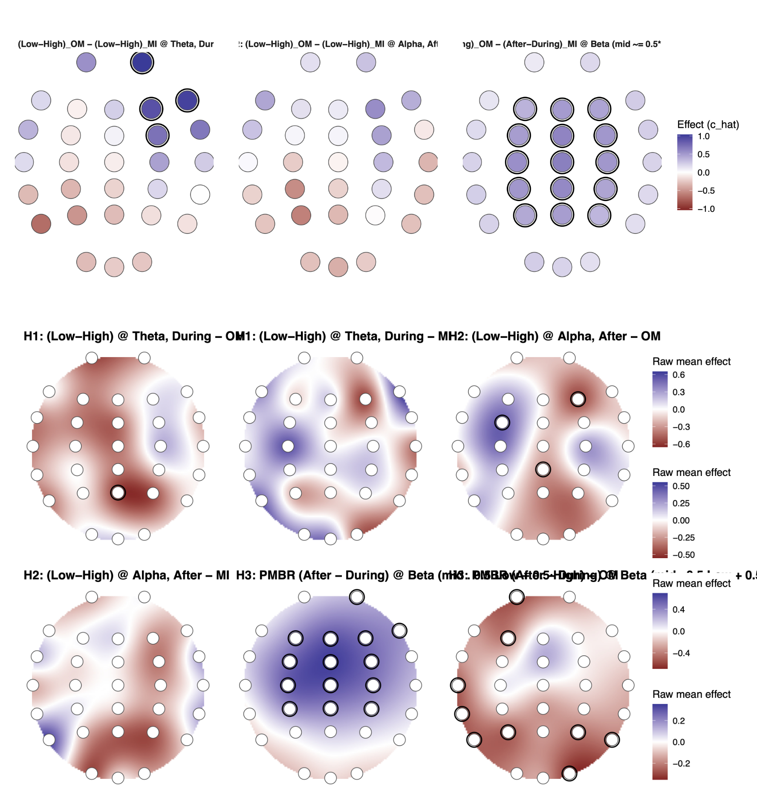

# DEMI — Detecting Errors in Motor Imagery

**Behaviour + EEG analyses for two related studies** on imagined movement accuracy (that is, do we make "errors" during motor imagery?), and how scalp‑level dynamics reflect those processes.

  
  &nbsp;
  

<em>Left: Behavioural task. Right: EEG results — <strong>work in progress</strong>; plotting cleanup pending.</em>

**At a glance:**

- **Behaviour:** Participants performed (overtly or imagined) a complex motor task designed to challenge motor acuity. Results support notion of motor imagery accuracy; similarly affected by drivers of overt movement error.
- **EEG:** Approach: task‑locked theta/alpha/beta dynamics modeled with **hierarchical GAMs (mgcv)**; contrasts via **difference‑of‑smooths**; confirmatory **cluster‑based permutation** inference. Results interpretation pending (manuscript in prep).

---

## What’s inside (brief)

- `/_Scripts/` — **all analysis code** (behaviour + EEG).  
  <small>Convention: scripts <code>00–03</code> = Behaviour paper; scripts <code>04+</code> = EEG paper.</small>
- `/external/` — EEG preprocessing pipeline (git submodule, pinned to a specific commit).
- `/legacy/` — dissertation‑era code (read‑only).
- `/media/` — curated figures displayed here (bulk plot dumps are ignored).
- `/_Data/` — **local‑only**; only `_Data/eeg/BESA-81.csv` (channel map) is tracked.
- `renv.lock`, `.Rprofile` — reproducible R environment via **renv**.

## Methods snapshot

- **Behavioural:** 
  - Behavioural task: single-session touchscreen path-tracing with imagery and overt execution, repeated vs random shapes, varying complexity and stimulus durations. 
  - Metrics: overt error = DTW-aligned mean Euclidean deviation; performance = z(speed/error); imagery expected performance obtained by fitting a hierarchical model to overt trials and projecting to imagery. 
  - Modelling: Bayesian multilevel regressions (participant random effects; standardized predictors, weakly informative priors) tested self-reported accuracy ~ expected/actual performance with condition interactions; secondary models examined movement time ~ condition × stimulus-time × complexity.
- **EEG:** (**WIP**); manuscript in prep. See scripts under `/_Scripts/`.

## Results / Manuscripts

- **Behaviour:** 

> Ingram, T. G. J., Hurst, A. J., Solomon, J. P., Stratas, A., & Boe, S. G. (2022). Imagined movement accuracy is strongly associated with drivers of overt movement error and weakly associated with imagery vividness. *Journal of Experimental Psychology: Human Perception and Performance, 48*(12), 1362–1372. https://doi.org/10.1037/xhp0001064

- **EEG:** (**WIP**); manuscript in prep. See scripts under `/_Scripts/`.

## Reproducibility & setup

<strong>Reproduce (collapsed)</strong>

**Clone with submodules**

    git clone --recurse-submodules https://github.com/toniolio/DEMI.git
    cd DEMI

**Restore R environment**

    R -q -e 'install.packages("renv", repos="https://cloud.r-project.org"); renv::restore(); renv::status()'

**Data** live under `_Data/` (local only). See scripts in `/_Scripts/` for run order and expected inputs.

<strong>Submodule (EEG preprocessing) — details (collapsed)</strong>

The pipeline in `/external/` is pinned to a specific commit.
To intentionally update it:

    cd external/DEMI_EEG_Pipeline
    git fetch origin
    git checkout <new-commit-or-tag>
    cd ../..
    git add external/DEMI_EEG_Pipeline
    git commit -m "external: bump EEG pipeline to <sha|tag>"

## Citation

Please cite this repository and the related manuscripts when using the code, figures, or results.

- Use GitHub’s **Cite this repository** button (powered by this repo’s [`CITATION.cff`](CITATION.cff)) to export BibTeX/APA/EndNote.
- The full citation metadata (authors, title, version, release date) live in [`CITATION.cff`](CITATION.cff).

## License

Code in this repository is released under the <strong>MIT License</strong>. See [`LICENSE`](LICENSE).
