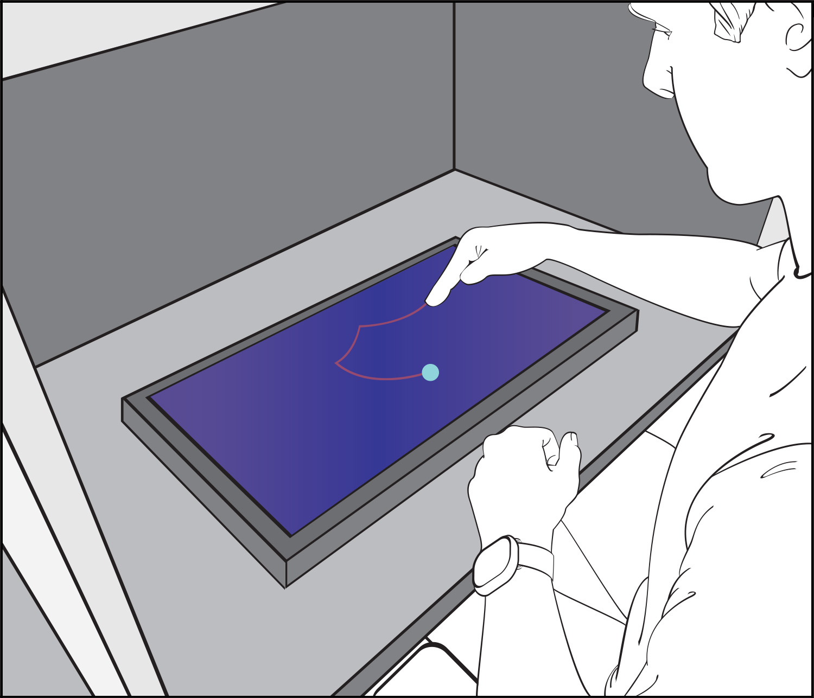
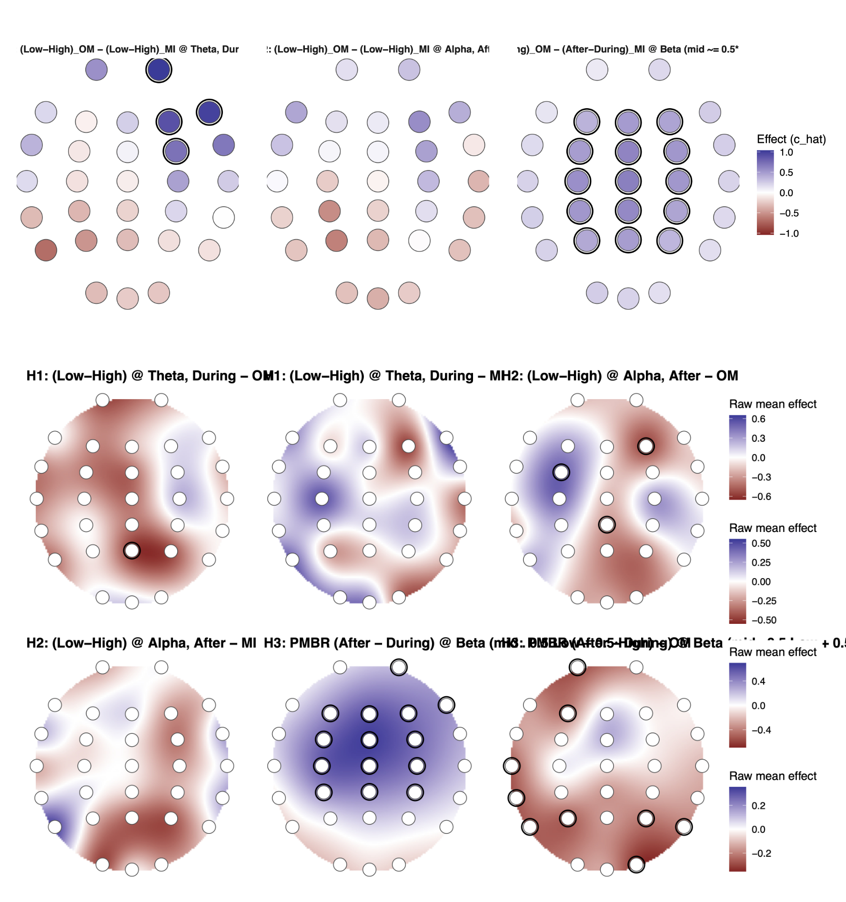

# DEMI — Detecting Errors in Motor Imagery

**Behaviour + EEG analyses for two related studies** on imagined movement accuracy (that is, do we make "errors" during motor imagery?), and how scalp‑level dynamics reflect those processes.

  
  &nbsp;
  

<em>Left: behavioural task. Right: an earlier exploratory EEG result retained for provenance; the active EEG reanalysis has not yet produced results.</em>

**At a glance:**

- **Behaviour (Published):** Participants performed (overtly or imagined) a complex motor task designed to challenge motor acuity. Results support the existence of motor-imagery "accuracy" (not just vividness), which was influenced by many of the same factors that affected overt movement error.
- **EEG (active reanalysis):** Raw recordings are being reprocessed with a Python/MNE-first workflow. The earlier hierarchical-GAM analysis is retained as historical provenance, not the active confirmatory pipeline.

---

## What’s inside (brief)

- [`analysis/eeg_mne/`](analysis/eeg_mne/README.md) — active raw/MNE EEG evidence scripts and versioned continuous-preprocessing implementation.
- [`analysis/behavior/`](analysis/behavior/README.md) — frozen-behaviour and TraceLab linkage reconstruction required by the EEG reanalysis; it is not a new behavioural analysis.
- [`_Scripts/`](_Scripts/README.md) — published behavioural workflow plus the earlier EEG/GAM workflow, retained for reproducibility and provenance.
- [`external/DEMI_EEG_Pipeline/`](external/DEMI_EEG_Pipeline/) — pinned historical EEG preprocessing submodule; reference evidence, not the active pipeline.
- [`legacy/dissertation/`](legacy/dissertation/README.md) — dissertation-era archive (read-only reference).
- `/media/` — curated figures displayed here (bulk plot dumps are ignored).
- `/_Data/` — local raw data and generated evidence. These are ignored except for `_Data/eeg/BESA-81.csv`, the tracked historical Oostenveld/BESA unit-sphere coordinate table used by the earlier EEG workflow and provenance audits.
- `renv.lock`, `.Rprofile` — reproducible R environment via **renv**.

## Methods snapshot

- **Behavioural:** 
  - Behavioural task: single-session touchscreen path-tracing with imagery and overt execution, repeated vs random shapes, varying complexity and stimulus durations. 
  - Metrics: overt error = DTW-aligned mean Euclidean deviation; performance = z(speed/error); imagery expected performance obtained by fitting a hierarchical model to overt trials and projecting to imagery. 
  - Modelling: Bayesian multilevel regressions (participant random effects; standardized predictors, weakly informative priors) tested self-reported accuracy ~ expected/actual performance with condition interactions; secondary models examined movement time ~ condition × stimulus-time × complexity.
- **EEG:** (**WIP**); the active reanalysis starts under `analysis/eeg_mne/`. See `docs/eeg_reanalysis_plan.md` for scope. Historical EEG/GAM scripts remain under `/_Scripts/`.

## Results / Manuscripts

- **Behaviour:** 

> Ingram, T. G. J., Hurst, A. J., Solomon, J. P., Stratas, A., & Boe, S. G. (2022). Imagined movement accuracy is strongly associated with drivers of overt movement error and weakly associated with imagery vividness. *Journal of Experimental Psychology: Human Perception and Performance, 48*(12), 1362–1372. https://doi.org/10.1037/xhp0001064

- **EEG:** (**WIP**); manuscript in preparation. The active path includes a saved, resumable continuous-preprocessing validation cohort. It is not a full-recording production run and does not construct epochs or produce active reanalysis results. See [`analysis/eeg_mne/README.md`](analysis/eeg_mne/README.md).

## Reproducibility & setup

<strong>Reproduce (collapsed)</strong>

**Clone with submodules**

    git clone --recurse-submodules https://github.com/toniolio/DEMI.git
    cd DEMI

**Restore R environment**

    R -q -e 'install.packages("renv", repos="https://cloud.r-project.org"); renv::restore(); renv::status()'

**Data** live under `_Data/` and remain local. The active EEG preparation path, environment setup, run order, output locations, and validation commands are documented in [`analysis/eeg_mne/README.md`](analysis/eeg_mne/README.md).

<strong>Submodule (EEG preprocessing) — details (collapsed)</strong>

The historical pipeline in `/external/` is pinned to a specific commit. It is retained so earlier preprocessing decisions can be audited; it is not an instruction to use that pipeline for the active reanalysis.
To intentionally update it:

    cd external/DEMI_EEG_Pipeline
    git fetch origin
    git checkout <new-commit-or-tag>
    cd ../..
    git add external/DEMI_EEG_Pipeline
    git commit -m "external: bump EEG pipeline to <sha|tag>"

## Citation

Please cite this repository and the related manuscripts when using the code, figures, or results.

- Use GitHub’s **Cite this repository** button (powered by this repo’s [`CITATION.cff`](CITATION.cff)) to export BibTeX/APA/EndNote.
- The full citation metadata (authors, title, version, release date) live in [`CITATION.cff`](CITATION.cff).

## License

Code in this repository is released under the <strong>MIT License</strong>. See [`LICENSE`](LICENSE).
